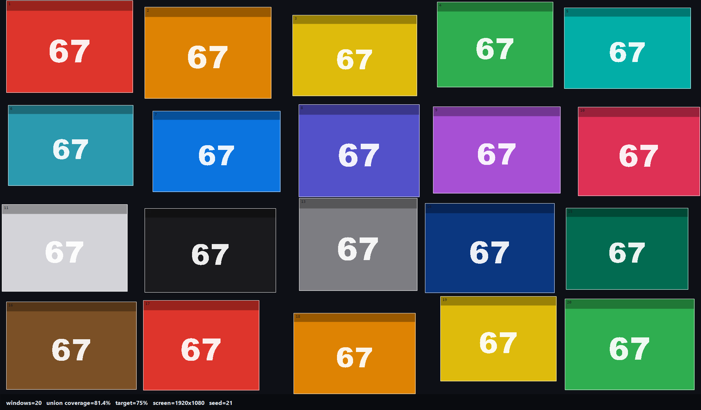
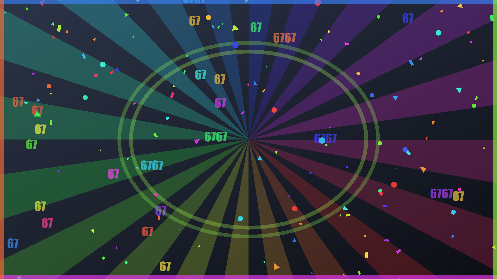
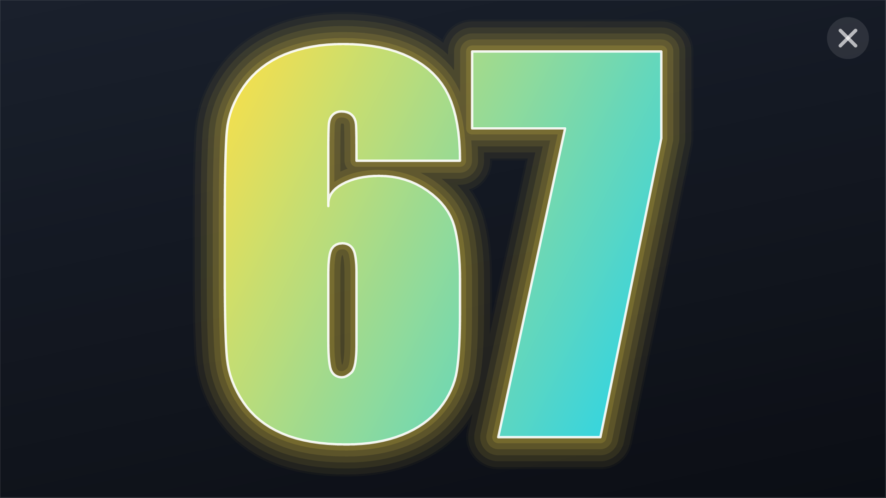
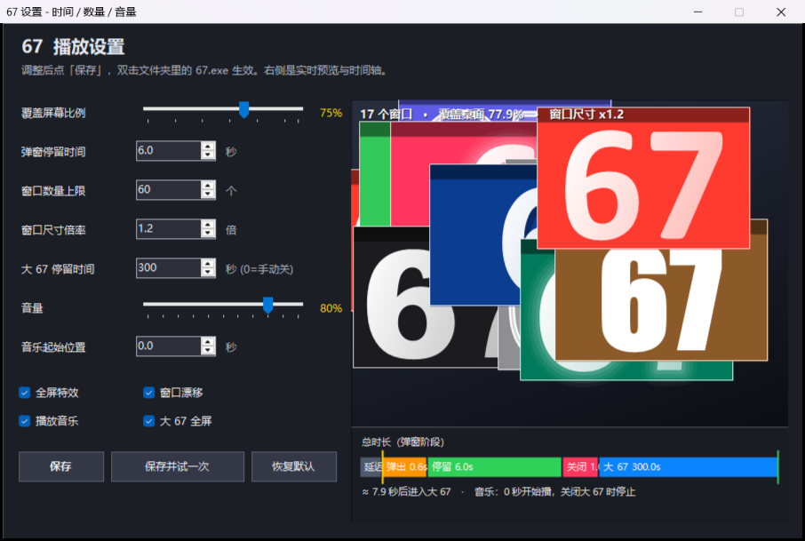

# 67 · 桌面弹窗狂欢 / Desktop Popup Show

**中文** ｜ [English](#english)


一键炸出满屏 `67`：一堆**真正的原生窗口**随机铺满整块屏幕，配上逐像素全屏特效和《67》配乐，
小窗逐个关闭、音乐不停，最后留下一个**全屏的巨大 `67`** —— 你关掉它的那一刻，音乐才停止。

> Windows 端是编译好的原生 Win32 程序（WinForms + GDI+，**不是 HTML / 不是浏览器套壳**）。
> Linux / macOS 端是零依赖的 Python 3 + tkinter 客户端，行为完全一致。



<p align="center">
  
  
</p>



---

## 目录

- [效果流程](#效果流程)
- [四端能力概览](#四端能力概览)
- [原理：每个功能是怎么实现的](#原理每个功能是怎么实现的)
- [快速开始](#快速开始)
- [可视化设置工具](#可视化设置工具)
- [命令行参数](#命令行参数)
- [常见问题 FAQ](#常见问题-faq)
- [音频免责声明](#音频免责声明)
- [测试记录](#测试记录)
- [仓库结构](#仓库结构)
- [English](#english)

---

## 效果流程

| 阶段 | 发生什么 | 默认时长 |
| --- | --- | --- |
| ① 延迟 | 程序启动、读取 `67.ini`、预加载音频、建好布局（此时还没有窗口） | 0.3 秒 |
| ② 弹出 | 约 16-20 个原生窗口在全屏随机位置连环炸出，每个都带独立配色/字体/贴纸；同时音频从开头播放，全屏特效层叠加 | 约 0.6 秒 |
| ③ 停留 | 窗口停在屏幕上，颜色缓缓流转、部分窗口轻微漂移，特效层继续放射光线与 67 雨 | 6 秒 |
| ④ 关闭 | 窗口从最上层开始一个个缩小淡出；**音乐继续播放**，特效层淡出 | 约 1 秒 |
| ⑤ 巨大 67 | 铺满整屏的大 `67`（1920×1080 就是 1920×1080），特效层压在它**之上**继续飘彩纸 | 300 秒 / 直到你关 |
| ⑥ 结束 | 你关掉大 `67`（`Esc` / `×` / 右键 / 双击 / 自动超时）的瞬间，音乐淡出停止，进程退出，无残留 | — |

## 四端能力概览

| 能力 | Windows `67.exe` | Windows `67-Settings.exe` | Linux / macOS `67.py` |
| --- | --- | --- | --- |
| 原生窗口轰炸 | ✅ WinForms 顶层窗口 | — | ✅ tkinter Toplevel |
| 随机铺满 + 分区保证 | ✅ | 预览同样算法 | ✅ |
| 全屏特效层（逐像素透明 / 鼠标穿透） | ✅ | — | ✅ 整屏半透明特效窗 |
| 音频随大 67 关闭而停止 | ✅ | — | ✅ |
| DPI / 分辨率自适应 | ✅ | ✅ | ✅（由系统缩放处理） |
| 可视化调参 + 实时预览 + 时间轴 | — | ✅ | — |
| 免安装 | ✅ 单文件 exe | ✅ | ✅ 只要 Python 3 |

## 原理：每个功能是怎么实现的

### 1. 全屏自适应（DPI 与分辨率）

**问题**：程序如果不声明 DPI 感知，Windows 会在 125% / 150% / 200% 缩放的屏幕上
交给它一个「被虚拟化、缩小」的桌面坐标（例如本机实际 1920×1080，程序只看到 1536×816），
于是窗口全被摆到了左上角一小块区域。

**实现**（`windows/src/Dpi.cs`、`windows/src/Display.cs`）：

1. 启动最早期（还没有创建任何窗口句柄之前）依次尝试
   `SetProcessDpiAwarenessContext(PER_MONITOR_AWARE_V2)` → `SetProcessDpiAwareness(2)` →
   `SetProcessDPIAware()`，拿到真实像素坐标；
2. 再用 `EnumDisplaySettings(ENUM_CURRENT_SETTINGS)` 读出显卡真实显示模式，
   与 `Screen.Bounds` 交叉核对，差值超过 2 像素就判定「拿到的是虚拟化尺寸」，
   直接改用真实分辨率；
3. 真的遇到奇葩环境时还有两个手动开关：`--area 2560x1440` 强制桌面尺寸、`--no-dpi` 关闭感知；
4. `Dpi.Scale`（DPI ÷ 96）用来同步放大窗口的最小尺寸，保证 200% 屏幕上窗口物理大小不缩水。

### 2. 弹窗布局：随机撒点 + 分区保证

**目标**：要「随机」的观感，但不能出现空角或全挤中间。

**实现**（`windows/src/Layout.cs` 的 `BuildScatter`，Python 端同算法）：

1. 窗口数量 `N` 由覆盖率推导：`N = round(coverage × 26)`，再夹在 `--min / --max` 之间；
2. 每个窗口的面积按三档随机抽：**大**（约 6%–11% 屏面积）、**中**（2.8%–5%）、**小**（1.2%–2.4%），
   再乘上 `--scale` 与覆盖率修正系数，于是大小差异明显；
3. 长宽比随机取 1.1–2.6，中心点在全屏**完全随机**，允许互相重叠、允许 20% 轻微出屏；
4. 撒完点后把屏幕切成 **4×4 = 16 个区域**逐格检查，哪个区域没有窗口中心就补一个进去 ——
   这一步就是「均匀」的真正含义：不是摆成网格，而是**每个区域都有**；
5. 覆盖率用 8 像素栅格实时统计（并集面积），运行日志里会打印实际值。

另外还保留两种风格：`--layout grid`（规整网格，缝隙均匀）、`--layout chaos`（早期完全放任的贪心算法）。

### 3. 窗口内的 `67` 渲染

**实现**（`windows/src/Render.cs`）：

- 用 GDI+ `GraphicsPath.AddString` 在 200 号字下取到字形轮廓，量出包围盒，
  再算出一个缩放矩阵**精确填满**窗口（默认占宽 94%、占高 88%），所以窗口越大 `67` 越大，不会留白；
- 5 种画法：**实心 / 双色渐变 / 描边 / 投影 / 霓虹辉光**；
- 贴纸装饰：四角星、五角星、闪电、爱心、圆环，随机位置/角度/颜色；
- 梗化表情：约 22% 的窗口会画上大小眼笑脸或墨镜（`DrawFace`）；
- 彩虹色轮：定时器每 55 毫秒推进色相，并轮流重绘约 1/5 的窗口，颜色持续流转而不卡；
- 弹出动画：窗口出现时把内容从 35% 缩放到 100% 并带一点点回弹（`ExtraScale`），
  配合 18 毫秒一批的快速点名，形成「炸开」的感觉；
- 边框花样：6 种 `FormBorderStyle`（无边框 / 固定 / 可调 / 3D / 对话框 / 工具窗口），
  随机决定要不要出现在任务栏、要不要显示图标。

### 4. 全屏特效层

**实现**（`windows/src/Fx.cs`）：

- 一个**无边框、置顶、鼠标穿透**（`WS_EX_TRANSPARENT | WS_EX_LAYERED | WS_EX_NOACTIVATE | WS_EX_TOOLWINDOW`）
  的全屏窗口，从不抢焦点：你依然可以点击下面的窗口；
- 画面不走普通 WM_PAINT，而是每帧画进 32bpp 位图后调用 `UpdateLayeredWindow` 推送，
  实现**逐像素透明**（关键点：必须先做 **alpha 预乘**，否则半透明区域会发白 —— 这是本项目踩过的坑）；
- 特效内容：旋转的彩虹放射光、飘落的 `67` 雨、旋转彩纸（矩形/圆/三角）、
  从中心扩散的光环、四周霓虹描边、开场白闪；
- 用 `SetWindowPos(HWND_TOPMOST)` 把特效层压在「被激活的置顶巨窗」之上，
  否则前台窗口会永远盖住它；
- 弹窗阶段一层（强），巨窗阶段一层（柔），关窗时淡出。

### 5. 音频生命周期

- Windows：`System.Windows.Media.MediaPlayer`（.NET Framework 自带组件，不弹播放器窗口），
  启动时预加载、弹窗出现时从 `--audio-start`开始播放；
- Linux / macOS：按 `afplay`（macOS）→ `mpv` → `ffplay` → `mplayer` → `mpg123` → `paplay`
  的顺序自动挑一个系统播放器，用独立进程组启动，结束时连同子进程一起关闭；
- **停止时机**：小窗关闭时**什么都不做**，音乐继续；
  直到巨大 `67` 被关闭（`Esc` / `×` / 右键 / 双击 / 自动超时）才淡出停止（Windows 端 0.5 秒淡出）。

### 6. 可视化设置工具

`67-Settings.exe` 右侧的预览**复用同一个布局引擎**（不是画个示意图），
所以你看到的窗口数量、覆盖率、大小就是真实效果；底部时间轴把
「延迟 → 弹出 → 停留 → 关闭 → 大 67」画成条形并标出音乐何时开始、何时停止。
所有设置写入同目录 `67.ini`，`67.exe` 启动时读取，命令行参数优先级更高。

### 7. 关闭与安全机制

- `Esc` 在任何窗口上都可用（每个窗口都绑定了按键处理，特效层也接了一个兜底）；
- 大 `67` 支持右上角 `×`、右键菜单、双击、自动超时（`--final`，0 表示只等你手动关）；
- 主程序用一个不可见的宿主窗口维持消息循环，关闭即退出，**不留后台进程、不改注册表、不联网**；
- 弹窗关闭阶段有安全网：即使某个窗口动画卡住，也会在超时后被强制关闭，保证一定进入下一阶段。

---

## 快速开始

### Windows

1. （可选）双击 `windows/67-Settings.exe` 调时间/数量/音量，点「保存并试一次」立刻预览；
2. 双击 `windows/67.exe` 开演；
3. 结束方式：`Esc` / 大 `67` 右上角 `×` / 右键 / 双击。

### macOS

```bash
cd linux-mac
chmod +x 67.command 67.py      # 首次
./67.command                   # 或在访达里双击 67.command
```

### Linux

```bash
cd linux-mac
chmod +x 67.sh 67.py
./67.sh                        # 或 python3 67.py
```

没装过 Python 的话：macOS 用系统自带 `python3`；Debian/Ubuntu 装
`sudo apt install python3-tk`（tkinter 通常已在 python3 标准包里）。

---

## 可视化设置工具

| 可调项 | 范围 | 说明 |
| --- | --- | --- |
| 覆盖屏幕比例 | 40% – 95% | 决定窗口数量与大小 |
| 弹窗停留时间 | 0.5 – 60 秒 | 第 ③ 阶段的时长 |
| 窗口数量上限 | 5 – 120 | 与覆盖率共同决定实际数量 |
| 窗口尺寸倍率 | 0.5 – 2.5 倍 | 整体放大缩小 |
| 大 67 停留时间 | 0 – 3600 秒 | 0 = 一直留着直到你关 |
| 音量 | 0 – 100% | |
| 音乐起始位置 | 0 – 300 秒 | 想从副歌开始就往后拖 |
| 开关 | 全屏特效 / 窗口漂移 / 播放音乐 / 大 67 全屏 | |

按钮：`保存`（写 `67.ini`）、`保存并试一次`（立刻运行 `67.exe`）、`恢复默认`。

## 命令行参数

Windows（`67.exe`）：

```
--coverage 0.75      目标覆盖率 0.20-0.95     --min 10 --max 60   窗口数量范围
--hold 6.0           弹窗停留秒数             --final 300         大 67 自动关闭秒数（0=不自动）
--delay 0.3          开始前等待秒数           --window-scale 1.2  窗口尺寸倍率
--layout scatter     布局：scatter(默认)/grid/chaos
--volume 0.8         音量                     --audio-start 0     音频起始秒数
--audio <文件>       换音频                   --no-audio          静音
--no-fx              关掉全屏特效             --no-wobble         关掉窗口漂移
--no-final-fullscreen  大 67 不全屏（留边）   --final-fullscreen  强制全屏
--all-screens        铺满所有显示器           --layout-work-area  只在工作区布局
--area 2560x1440     强制桌面尺寸             --no-dpi            关闭 DPI 感知
--seed 12345         固定随机布局             --config <文件>     指定配置文件
--log run.txt        输出执行日志
--dump-layout a.png / --dump-finale a.png / --dump-fx a.png   离屏导出预览图（不弹窗）
--help               参数说明弹窗
```

Linux / macOS（`67.py`）：`--coverage --min --max --hold --final --delay --scale
--audio --audio-start --volume --no-audio --no-fx --no-jitter --seed --dump-layout`

## 常见问题 FAQ

**Q：Windows 上双击没反应 / 提示「应用程序控制策略已阻止此文件」？**
这是 Windows「智能应用控制（Smart App Control）」在按文件哈希做云端信誉判定，
未签名的新 exe 偶尔会被误拦。双击 `windows/build.cmd` 重新编译一份（脚本每次写入新版本戳，
哈希不同、会重新判定）即可；也可以直接运行源码或用 Python 客户端。

**Q：窗口全挤在左上角？**
已被 DPI 自适应修复。若你的环境仍异常，先用 `67.exe --log run.txt` 跑一次，
日志里会打印 `dpi / awareness / layout / full screen` 实测值；必要时加 `--area 你的分辨率`。

**Q：没有声音？**
Windows 端需要 `windows/audio/67.m4a` 存在（或 `--audio <文件>`）；
Linux/macOS 端需要 `linux-mac/67.m4a`，并且系统里有上面列出的任一播放器。
也可以 `--no-audio` 直接静音运行。

**Q：会不会影响系统 / 留后台程序？**
不会。程序不联网、不写注册表、不改文件、不开机自启；关闭窗口即结束进程。
唯一写入的是设置工具生成的 `67.ini`。

**Q：想改成一成不变的布局？**
`--seed 12345`，同一个种子每次布局都一样。

## 音频免责声明

仓库中的 `windows/audio/67.m4a` 与 `linux-mac/67.m4a` 来自抖音音乐页的《67》（作者 DJ R4），
**仅作为本项目演示/个人娱乐用途随仓库附带**，音频版权归原作者及权利方所有，本项目不主张任何权利，
也不对其作任何商业使用或再授权。如果你是权利人并希望移除，请提 Issue，我会立刻删除。
你也可以随时用 `--audio <你的文件>` 换成自己的音频，或 `--no-audio` 静音运行。

## 测试记录

Windows 11（实际分辨率 1920×1080 @125% 缩放，单屏）实测：

- 真实分辨率识别：`dpi 120 → x1.25, awareness per-monitor-v2, layout 1920x1080`；
- 布局：20 个窗口 / 并集覆盖 **79.0%**（目标 75%），4×4 区域无空缺；
- 巨大 67：`1920x1080` 整屏（含任务栏区域），特效层叠于其上；
- 音频：从 0 秒开始播放，小窗全关时**继续**，手动关闭大 67 的瞬间
  `audio: stop requested` → `stopped`；
- 完整流程退出码 **0**，无残留进程；`Esc` 中止同样退出码 0 且音乐立即停止；
- 特效层峰值约 0.9–1.2 个核心（8 核机器约 12%），持续约 8 秒。

Linux / macOS 客户端（Python 3.14 + tkinter 9.0 上验证逻辑与流程）：
25 个窗口 / 覆盖 79.4% / 流程走完退出码 0 / 无残留进程。

## 仓库结构

```
windows/             Windows 客户端与源码
  67.exe             主程序（免安装）
  67-Settings.exe    可视化设置工具
  build.cmd          重新编译（生成新版本戳）
  audio/67.m4a       演示音频（版权见上）
  src/               14 个 C# 源文件（DPI、布局、渲染、特效、音频、设置…）
linux-mac/           Linux / macOS 客户端
  67.py              零依赖 Python 3 主程序
  67.sh / 67.command Linux / macOS 启动器
  67.m4a             演示音频（版权见上）
docs/                README 用预览图
USAGE.md             详细使用说明（新手一步一步版）
```

## License

代码：MIT（见 [LICENSE](LICENSE)）。音频除外，版权归原作者所有。

---

<a id="english"></a>

# English


**A `67` desktop show.** One double click bursts a pile of **real native windows** over your
entire screen, wraps them in a per-pixel full-screen effect layer and plays the `67` soundtrack.
The small windows close one by one while the music keeps playing, and one **giant full-screen
`67`** is left behind. The music stops the moment *you* close that giant window.

The Windows build is a compiled native Win32 app (WinForms + GDI+, **no HTML, no browser shell**);
the Linux/macOS build is a dependency-free Python 3 + tkinter client with the same behaviour.

## How it works

**1. Full screen on every device.** A process without DPI awareness is handed a *virtualised,
smaller* desktop on scaled displays (on the machine this was built on, 1920×1080 physical showed
up as 1536×816), which is why the old build parked every window in the top-left corner.
The app now declares `PER_MONITOR_AWARE_V2` (falling back to per-monitor / system awareness)
before creating any window, then cross-checks `Screen.Bounds` against the real video mode from
`EnumDisplaySettings` and switches to the real resolution when they disagree. `--area WxH` and
`--no-dpi` remain as manual escape hatches.

**2. Random but complete layout.** Window count comes from the coverage target
(`N = round(coverage × 26)`, clamped by `--min/--max`). Each window draws its area from three size
classes (big ≈ 6–11% of the screen, medium ≈ 2.8–5%, small ≈ 1.2–2.4%), a random aspect ratio and a
completely random centre, so they overlap and even hang over the edges. Afterwards the screen is split
into a **4×4 grid of regions** and any empty region gets an extra window: "even" means *no empty
area*, not *a rigid grid*. Coverage is measured live on an 8 px raster and printed in the run log.
`--layout grid` and `--layout chaos` are still available.

**3. The `67` artwork.** Glyph outlines come from GDI+ `GraphicsPath.AddString` at em-size 200;
the bounding box is measured and a matrix scales the path to fill the window (94% × 88%),
so the number always fills its frame. Five render styles (solid / gradient / outline / shadow /
neon), random fonts, vector stickers (stars, bolts, hearts, rings), cartoon faces (googly eyes or
sunglasses) on ~22% of windows, a hue wheel that repaints a rolling fifth of the windows every 55 ms,
a pop-in scale animation and six different window border styles.

**4. The effect layer.** A borderless, always-on-top, **click-through** window
(`WS_EX_LAYERED | WS_EX_TRANSPARENT | WS_EX_NOACTIVATE | WS_EX_TOOLWINDOW`) that never takes focus.
Each frame is drawn into a 32bpp bitmap and pushed with `UpdateLayeredWindow` for true per-pixel
alpha — the important detail is **premultiplying alpha**, otherwise translucent areas wash out white.
It draws rotating rainbow rays, falling `67` rain, confetti, expanding rings, a neon border and an
opening flash, and uses `SetWindowPos(HWND_TOPMOST)` so it stays above the activated giant window
(the foreground window would otherwise always cover it).

**5. Music lifecycle.** Windows uses `System.Windows.Media.MediaPlayer` (part of .NET Framework,
no external player window); Linux/macOS pick the first available system player from
`afplay` (macOS) → `mpv` → `ffplay` → `mplayer` → `mpg123` → `paplay` and start it in its own process
group. The clip starts when the burst starts, **keeps playing while the small windows close**, and is
faded out only when the giant `67` is closed (`Esc`, the top-right ×, right-click, double click or the
auto-close timer).

**6. Visual settings app.** `67-Settings.exe` renders its preview with the *real* layout engine, so the
window count, coverage and sizes you see are what you get; the strip underneath draws the phase
timeline (delay → burst → hold → close → giant) and marks when the music starts and stops.
Everything is stored in `67.ini` and can be overridden per run on the command line.

**7. Closing safely.** `Esc` works on every window (the effect layer has a fallback handler too),
the giant window closes via ×, right-click menu, double click or timeout, and a safety net force-closes
any stuck window so the show always reaches the next phase. Nothing is written to the registry,
nothing touches the network and no process is left behind.

## Quick start

- **Windows** – double click `windows/67.exe` (optionally tune it in `windows/67-Settings.exe` first).
- **macOS** – `cd linux-mac && chmod +x 67.command 67.py && ./67.command`
- **Linux** – `cd linux-mac && chmod +x 67.sh 67.py && ./67.sh`

Press `Esc` at any time to close everything.

## Notes

- The bundled audio is the Douyin track 《67》 by DJ R4. It is included **for personal
  entertainment / demo purposes only**; all rights remain with the original author.
  I do not claim any rights over it, and it will be removed on request by the rights holder.
- On Windows, Smart App Control can occasionally block a freshly compiled unsigned exe
  (it caches verdicts per hash). Running `windows/build.cmd` again produces a new binary hash
  and normally clears it.
- MIT licensed (code only).

6767676767676767676767676767676767676767676767676767676767676767676767676767
